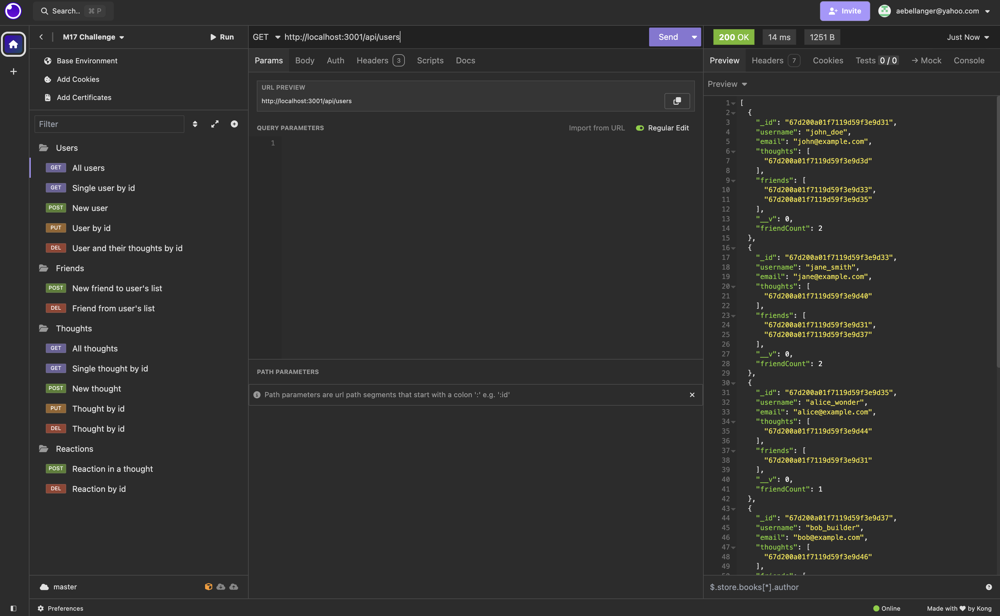

# NoSQL Social Network API

## Description

This project involves building an API for a social network application using Express.js, MongoDB, and the Mongoose ODM. The application supports user profiles, friends, and user-generated content called "thoughts" (similar to "posts" on Facebook). Users can also react to their friends' thoughts. Utilizing NoSQL databases like MongoDB is advantageous for social networks due to their ability to manage large volumes of unstructured data. This flexibility accommodates varying user information and interactions. During this project, I enhanced my development skills by working with a NoSQL database and gained proficiency in creating and testing routes using Insomnia.

## Table of Contents

- [Walkthrough Video](#walkthrough-video)
- [Installation](#installation)
- [Usage](#usage)
- [Credits](#credits)
- [License](#license)
- [Questions](#questions)

## Walkthrough Video

https://www.loom.com/share/17b7a7b872b34bb3ad81b59b3be44896?sid=18eba730-0789-4c61-b0c4-db66f3952d21

## Installation
1. Open your terminal and navigate to the directory where you want to store the repository.

2. Clone the repository to your local machine with the following command:

    ```sh
    git clone https://github.com/amelia1105/nosql-social-network.git
    ```

3. Navigate into the cloned repository's directory:

    ```sh
    cd nosql-social-network
    ```

4. Install the necessary dependencies by running:

    ```sh
    npm install
    ```

## Usage
To use this application, you need a method to connect to a MongoDB database, such as MongoDB Compass. This application uses the default MongoDB Compass connection string: `mongodb://localhost:27017/`. Additionally, Insomnia is used to test the application's routes, but other API testing platforms can be used.

1. Ensure you are connected to the correct port in MongoDB Compass.

2. Navigate to the `nosql-social-network` directory and run the following command to build the application:

    ```sh
    npm run build
    ```

3. Seed the database. If successful, you will see a console message saying "Seeding complete! 🌱" along with details of the actions performed on the database:

    ```sh
    npm run seed
    ```

4. Start the application:

    ```sh
    npm run start
    ```

5. Use Insomnia (or another route testing tool) to create requests for the required information. Different information is available on various route paths. For example, to get all users, use the route `http://localhost:3001/api/users`. To get all thoughts, use the route `http://localhost:3001/api/thoughts`. Below is an image of an Insomnia request to get all users in the database. This image also includes the other requests that can be made with this application.




## Credits

Although no starter code was available for this project, I used one of our previous class assignments to get the general layout of my files and to get some of the boilerplate code. This code is found in the 17-NoSQL Mini Project (in GitLab, RUT-VIRT-FSF-PT-10-2024-U-LOLC > 17-NoSQL > 01-Activities > 28-Stu_Mini-Project, found [here](https://git.bootcampcontent.com/Rutgers-University/RUT-VIRT-FSF-PT-10-2024-U-LOLC)). The config connection.ts file is the same with the exception of the database name. The root server.ts and package.json are also the same. The controller files, models, routes, and seeds follow a similar structure to the Mini Project, but I developed each of these myself. I also created the .gitignore file. I used GitHub Copilot and ChatGPT for debugging and for fake data, especially in the seed files and models.

## License

MIT License

Copyright (c) 2025 Amelia Alvarado

Permission is hereby granted, free of charge, to any person obtaining a copy
of this software and associated documentation files (the "Software"), to deal
in the Software without restriction, including without limitation the rights
to use, copy, modify, merge, publish, distribute, sublicense, and/or sell
copies of the Software, and to permit persons to whom the Software is
furnished to do so, subject to the following conditions:

The above copyright notice and this permission notice shall be included in all
copies or substantial portions of the Software.

THE SOFTWARE IS PROVIDED "AS IS", WITHOUT WARRANTY OF ANY KIND, EXPRESS OR
IMPLIED, INCLUDING BUT NOT LIMITED TO THE WARRANTIES OF MERCHANTABILITY,
FITNESS FOR A PARTICULAR PURPOSE AND NONINFRINGEMENT. IN NO EVENT SHALL THE
AUTHORS OR COPYRIGHT HOLDERS BE LIABLE FOR ANY CLAIM, DAMAGES OR OTHER
LIABILITY, WHETHER IN AN ACTION OF CONTRACT, TORT OR OTHERWISE, ARISING FROM,
OUT OF OR IN CONNECTION WITH THE SOFTWARE OR THE USE OR OTHER DEALINGS IN THE
SOFTWARE.

## Questions

For any questions about this project, please contact me by email: aebellanger@yahoo.com
